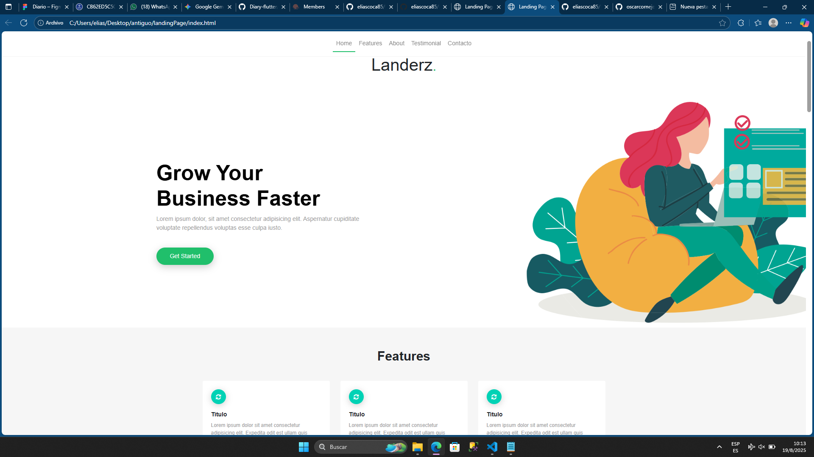
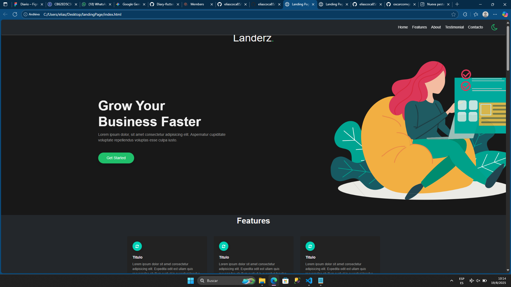

## Capturas de pantalla

### Antes

### Después

# landingPage (Modificado)

Este proyecto es un fork y modificación del repositorio original de Oscar Cornejo: [landingPage original](https://github.com/oscarcornejo/landingPage)

## Cambios realizados

- Se implementó un **modo oscuro** para toda la landing page, incluyendo formularios, carruseles, secciones y textos.
- Se agregó un **icono de modo oscuro** (luna) en el navbar, alineado a la derecha, que permite alternar entre modo claro y oscuro.
- El **navbar** fue modificado para  las opciones de navegación a la derecha.
- Se mejoró la visibilidad y el estilo del icono de modo oscuro.
- Se eliminaron todos los comentarios del código, excepto los que documentan los cambios realizados.
- Se mejoró la experiencia visual y de accesibilidad en modo oscuro para todos los componentes principales.

## Repositorios

- Repositorio original (sin modificar): [https://github.com/oscarcornejo/landingPage](https://github.com/oscarcornejo/landingPage)
- Repositorio modificado (este): [https://github.com/eliascoca85/LandingPage](https://github.com/eliascoca85/LandingPage)

---

Para cualquier duda o sugerencia, puedes contactarme en GitHub.

# Landing Page

Landing Page desarrollado en HTML, CSS y Javascript

## Comparte

Si te gusto el proyecto compártelo con otros, esto es un Landing Page GRATUITO para la comunidad de [FRONT END CHILE](https://www.facebook.com/groups/FrontEndChile/) y el mundo.

## Colaborar

Si encuentras algún error, o mejor aún, deseas mejorar lo que ya está implementado, eres bienvenido a realizar cambios, pero cuidado, todos los cambios serán revisados y validados antes de ser subidos o actualizados.
